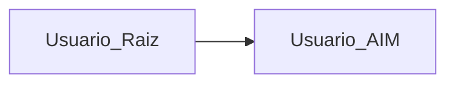
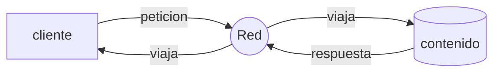
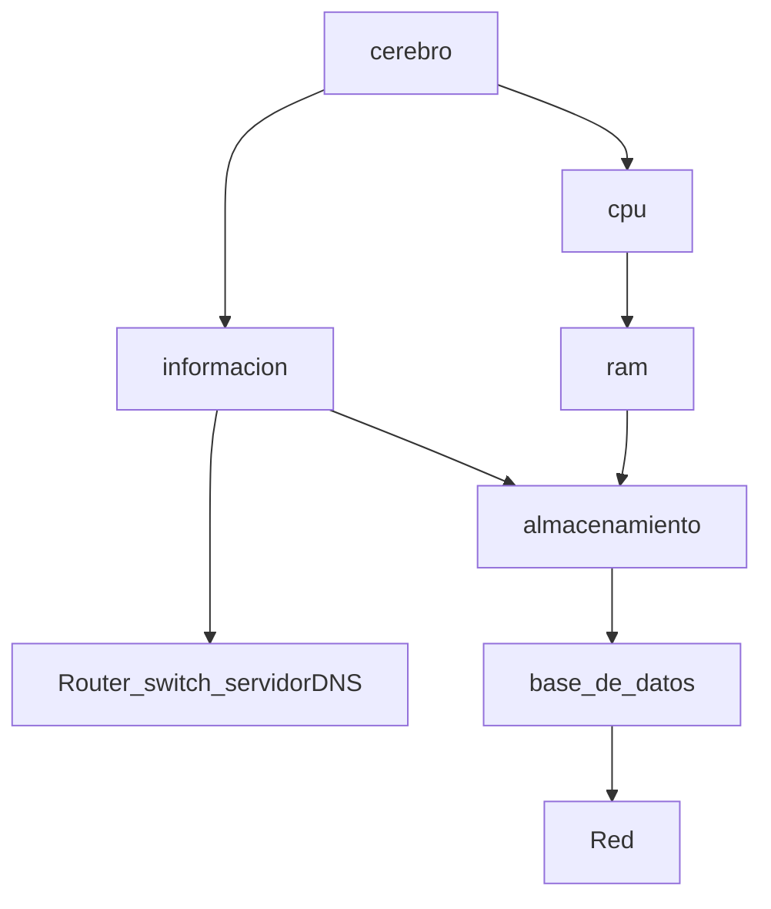
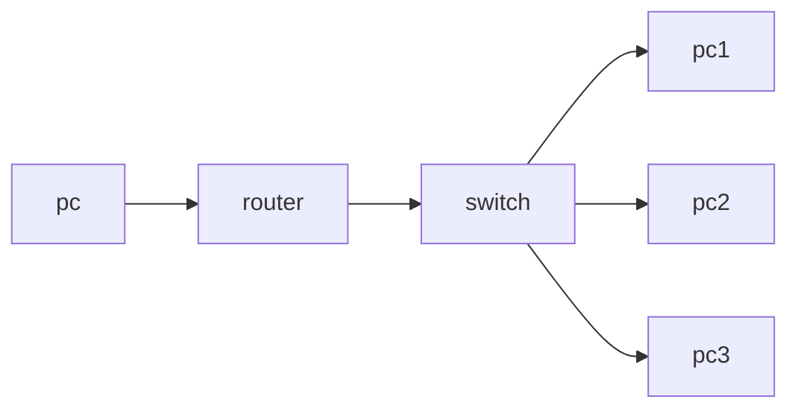
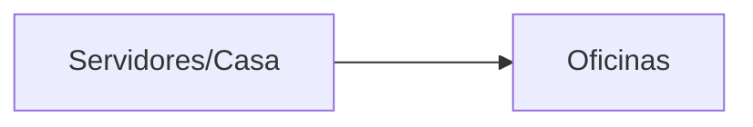
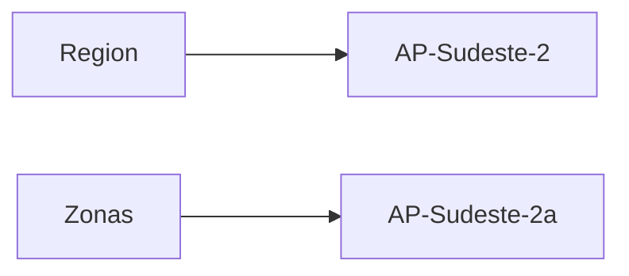
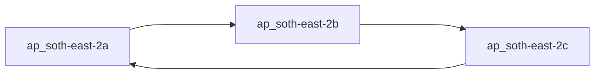
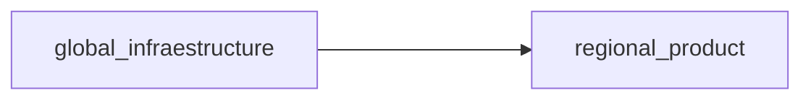
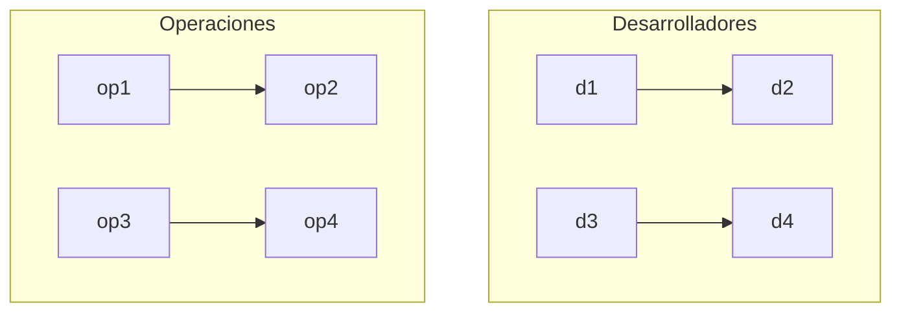

# AWS Certified Cloud Practitioner Course.

`AWS Database Migration Service`
- servicio utilizado para la migracion de una base de datos a AWS 


Existen dos manera de iniciar sesion en AWS 


## Cambio de idioma del Dashboard
****

en la parte inferior del navegadpr buscar el texto que dice `unified settings` donde podemos configurar el idioma de nuestra interfaz y la `Region` predeterminada donde alojaremos nuestros servicios, los nomnbres de los servicios seguiran en ingles.

## Cloud Computig.
****


los clientes se identifican por medio de una IP , los servidores tambien tienen una IP 
### funcionamiento.
***
un cliente con una IP especifica envia una peticion para acceder a un contenido cuando el servidor recibe la peticion del cliente devuelve una respuesta a esa determinada IP con el contenido que solicito.

### como se compone un servidor.


### Red.
***
Es lo que nos permite comunicarnos con un destinatario `cables , routers,servidores conectados entre si `

### Router
___
Dispositivo de red que reenvia paquetes de datos entre redes de ordenadores y que saben exactamente donde enviar los paquetes a traves de la red 

### Switch.
___
este dispositivo toma los paquetes y los envia a un servidor al que el cliente se ha conectado 


`infraestructura de un paquete enviado desde un pc , pasando por un router luego al switch hasta llegar a un despinatario (pc1...pcn)`

## Manera Tradicional de Constuir Infraestructuras
***


```
Contras
```
- pago de alquileres 
- pago suministro electrico refrigeracion y mantenimiento de los servidores
- cambio de hardware cada x cantidad de tiempo
- el escalado es limitado (cantidad de clientes soportados)
- contratar un equipo 24/7 para supervisar la insfraestructura
- eventos naturales, incendios, terremotos , apagones

## Que es el Cloud Computing.
Es un suministro de bajo demanda de potencia de calculo , almacenamiento de base de datos, aplicaiones y otros recursos informaticos, esta modalidad tiene pagos y precios dependiendo de su uso.
Cloud Computing nos permite aprovisionar excatamente el tipo y tamaño de los recursos informaticos que necesitamos. esto se refiere a que podemos seleccionar una maquina con las caracteristicas que necesitamos para nuestros requerimientos (ram, cpu) y podemos acceder a estos recursos casi de manera instantanea.

Cloud Computing es una manera sensilla de acceder a servidores, almacenamientos, bases de datos y un conjunto de servicios y aplicaciones 

Cloud Computing como `AWS` nos permite acceder a la cantidad de servidores que queramos sin preocuparnos por nada mas.

## Modelos de Despliegue Cloud.
***

### Cloud Privado.
- Servicios en el cloud utilizados por una sola organizacion, no expuestos al publico 
- nos da control total 
- gran seguridad y esta enfocado para aplicaciones sencillas
****
### Cloud Publico.
- Los recursos del cloud son propiedad de un proveedor de servicios , son operados por el y sus servicios se suministran atraves del internet 
***
### Cloud Hibrido.
- Servidores locales 
- Extension de servicios atraves del cloud 
***

## Caracteristicas del Cloud Computing.

## `Autoservicio Bajo Demanda (On-demand)`
Los usuarios pueden utilizar servicios aprovisionar recursos y utilizarlos sin interaccion humana con el proveedor de servicios 

## `Amplio Acceso a la Red`

Los recursos estas disponibles atraves  de la red y pueden ser accedidos por diversas plataformas de clientes 

## `Alquiler Multiple y Agrupacion de Recursos`

Varios clientes pueden compartir una misma infraestructura y aplicaciones con seguridad y privacidad.
multiples clientes reciben servicios desde los mismo recursos fisicos

##  `Rapida Elasticidad y Escabilidad`
Adquirir y disponer de recursos de forma automatica y rapida cuando sea necesario.
Escala rapida y facilmente en funcion a la demanda 

## `Servicio Medido`
el uso de los recursos se mide por lo que los usuarios pagan correctamente por lo que han utilizado 

## `Cambia el Gasto de Capital (capex) por el Gasto Operativo (opex)`
el usuario paga bajo demanda, no posee hardware propio 
reduccion del costo total de propiedad (TCO) y los gastos operativos

## `Nos Beneficiamos de Economias de Escala Masiva`
Los precios se reducen ya wur AWS es mas eficiente debido a la gran escala 

## `Dejar de Adivinar la Capacidad`
AWS nos aprovisiona de recursos a escala basado en el uso medido y real de nuestra aplicacion 

## `Aumento de la Celocidad y la Agilidad `
Ahorro de dinero en funcionamiento y mantenimiento de centro de datos 


# Problemas Resueltos con el uso de Cloud Computing.

## `Flexibilidad`
Cambia los tipos de recursos cuando sea necesario

## `Rentabilidad`
Pagas por lo que utilizas

## `Escalabilidad`
Permite acomodar mayores cargas, reforzando el hardware o añadiendo nodos adicionales

`alta disponibilidad y tolerancia a los fallos `

## `Agilidad`
desarrollar , testear y lanzar rapidamente aplicaciones de software


# Tipos de Cloud Computing
## `Infraestructura Como Servicio (IaaS)`
Proporciona bloques de construccion para la `IT` en el cloud , es decir que se proporcionan redes , ordenadores , servidores y espacion de almacenamiento, lo que nos lleva a poder construir lo que queramos gracias a estos bloques

## `Plataforma Como Servicio (PaaS)`
Elimina la necesidad de que tu organizacion gestiona la infraestructura subyacente
Se centra en el despliegue de nuestras aplicaciones 

## `Software Como Servicio (SaaS)`
Producto completo que es ejecutado y gestionando por el proveedor de servicios


|Instalaciones Fisicas|             |
|---------------------|-------------|
| - aplicaciones (yo) | - datos (yo) |
|- middleware (yo) |- tiempo de ejecucion (yo) |
|- os (yo) |- servidores (yo)|
|- networking (yo) |- virtualizacion (yo)|
| - almacenamiento (yo)|

| Infraestructura como Servicio (IaaS) |                      |
|--------------------------------------|----------------------|
| - aplicaciones (yo)                  | - datos (yo)         |
| - tiempo de ejecucion (yo)           | - middleware (yo)    |
| - os (yo)                            | - networking (otros) |
| - virtualizacion (otros)             | - servidores (otros) |
| - almacenamiento (otros)             |                      |

| Plataforma Como Servicio (PaaS) |                          |
|---------------------------------|--------------------------|
| - tiempo de ejecucion (otros)   | - middleware (otros)     |
| - os (otros)                    | - virtualizacion (otros) |
| - servidores (otros)            | - almacenamiento (otros) |
| - networking (otros)            | - aplicaciones (yo)      |
| - datos (yo)                    |

| Software Como Servicio (SaaS) |                          |
|-------------------------------|--------------------------|
| - tiempo de ejecucion (otros) | - middleware (otros)     |
| - os (otros)                  | - virtualizacion (otros) |
| - servidores (otros)          | - almacenamiento (otros) |
| - networking (otros)          | - aplicaciones (otros)   |
| - datos (otros)               |

`Gmail es un ejemplo de software como servicio (SaaS)`

## `Infraestructura Como Servicio`
- Amazon EC2 (aws)

## `Plataforma Como Servicio`

- Elastic Beanstalk (aws)

## `Software Como Servicio`
- en aws existen muchos servicios como Rekognition

# Precios en AWS 
Aws tiene 3 fundamentos de precios siguiendo el modelo de pago por uso 

## `Computacion`
Se paga por el tiempo de uso de computacion , poder de computo (lambda, EC2)

## `Almacenamiento`
Se paga por los datos almacenados en el cloud (S3)

##  `Transferencia de Datos Fuera del Cloud`
la trasferencia de datos hacia el cloud es gratuita, , hacia afuera tiene un cobro 

# Aws Como Infraestructura Global.
- Aws Regions
- Aws Availability Zones
- Aws Data Centers
- Aws Edge Locations (`puntos presencia aws`)

```
Importante!!
> informacionde la infraestructura de aws , estar mas cerca de tus usuarios , disminuye la latencia (retrazo de llegado de un paquete a su destino)
```

## Regiones en AWS
- Aws tiene regiones en practicamente todo el mundo 
- Los nombres tienen una nomenclatura

```mermaid
flowchart LR
us ---->east
east ---->numero
us ---> usa
punto_cardinal--->east
n_region ---> numero
style us fill:#0d0403
style east fill:#0d0403
style numero fill:#0d0403

```


- Una region es un grupo de centros de datos
- La mayoria de los servicios de AWS son de ambito regional 

## `Como Elegir una Region de AWS `

### `Cumplimiento de los requisitos legales y de gobernanza de datos`
- los datos nunca salen de una region sin un permiso explicito

### `Proximidad de los Clientes `
- para reducir la latencia

### `Servicios Disponibles en su Region`
- Generalmente los nuevos servicios o nuevas funciones no estan disponibles en todas las regiones 
- Los precios varian de una region a otra y son transparentes en la pagina de precios por servicios 

## Zonas de Disponibilidad de AWS 
****
Cada region tiene muchas zonas de disponibilidad, normalmente son :
- 3 zonas (normal)
- 2 zonas (minimo)
- 6 zonas (maximo)

## `ejemplo`
`AP-sudeste-2a`

`AP-sudeste-2b`

`AP-sudeste-2c`


- cada zona de disponibilidad es uno o varios centros con conectividad, red y alimentacion 
- cada zona esta separada en caso de catastrofe y conectadas por medio de banda ancha


`zonas conectadas entre si `

# Puntos de Presencia de AWS.
- Sirven para entregar contenido con la menor latencia posible al usuario final 
- Acercan el contenido a los usuarios

# Consola AWS 
## Servicios Globales 
- Identity and access management (`IAM`)
- Route 53 (`servicio DNS`)
- Cloud Front (`Red Entrega Contenido`)
- WAF (`Firewall de Aplicaciones Web`)

## Servicios Ambito Regional 
- Amazon EC2 (`Infraestructura como Servicio`)
- Elastic Beanstalk (`Plataforma Como Servicio`)
- Lambda (`Funcion Como Servicio`)
- Rekognition (`Software como Servicio`)

`Los servicios pueden ser vistos o divididos por las regiones que soportan o estan disponibles estos servicios`

___

- cada vez que creamos una instancia de algun servicio que no sea global , debemos preocuparnos de la region en que nos encontramos, si no , no seremos capaces de ver la instancia, si no nos encontramos en la region correcta 

## `Servicios Regionales`
- existe un link donde podemos seleccionar una region de aws y aqui se nos deplegaran todos los servicios para esta zona 



# IAM.
## `Identity and Access Management`

Este es un servicio global de AWS 

## `Cuenta Root / Raiz`

Esta es la cuenta creada por defecto, no debe ser utilizada ni compartida 

## `Usuarios`
IAM posee usuarios que son personas dentro de la organizacion, los cuales pueden ser agrupados


```
Importante!!
los grupos solo pueden tener usuarios , no pueden contener 
otros grupos , ni subgrupos

no es obligatorio que un usuario este en un grupo 
y un usuario puede estar en mas de un grupo 
```
# Permisos IAM
- A los usuarios o grupos se les puede asignar unos 
archivos json los cuales son llamados politicas

- En Aws se aplica el principio de minimo privilegio, no dar 
mas permisos de los que un usuario necesita


