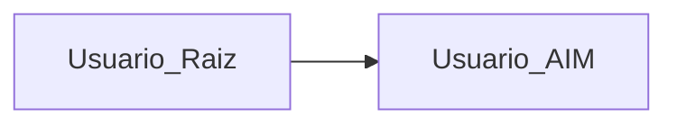
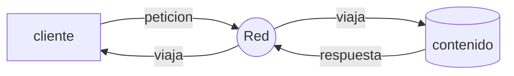
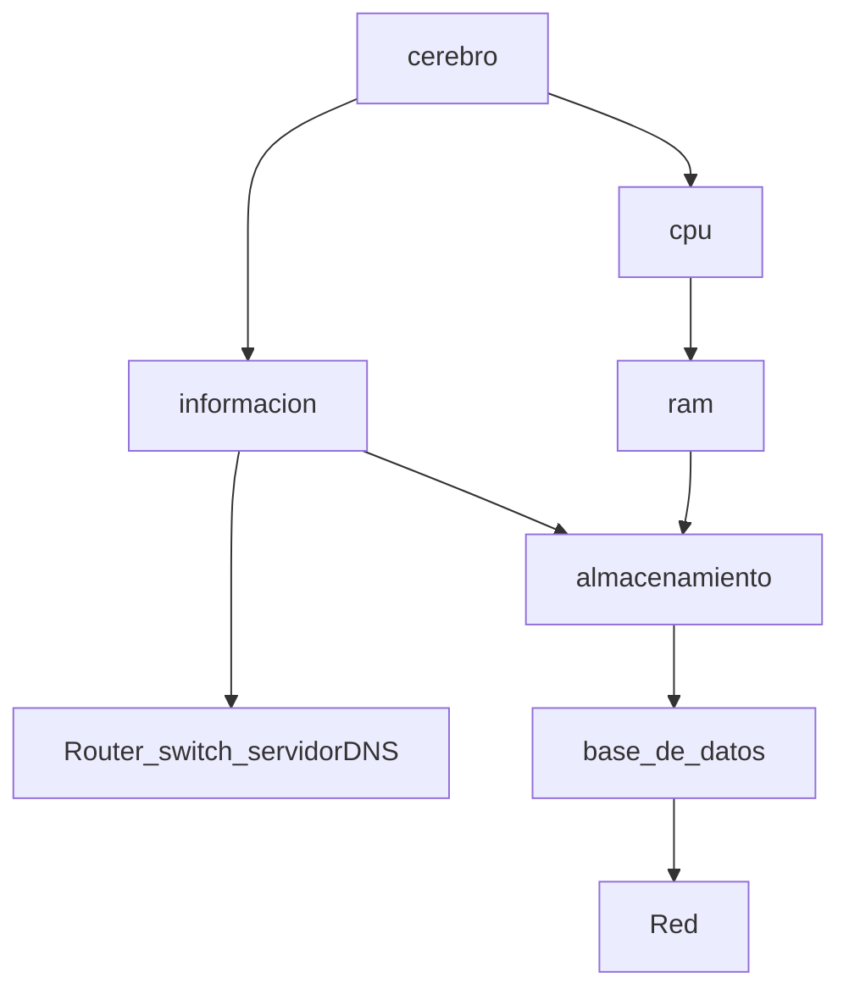
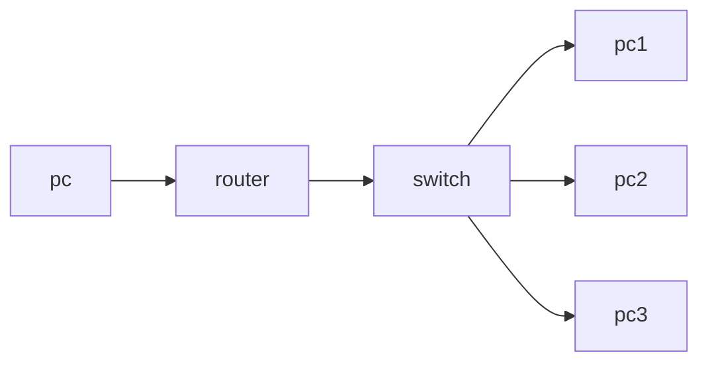
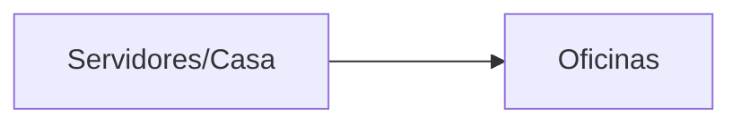

# AWS Certified Cloud Practitioner Course.

`AWS Database Migration Service`
- servicio utilizado para la migracion de una base de datos a AWS 


Existen dos manera de iniciar sesion en AWS 


## Cambio de idioma del Dashboard
****

en la parte inferior del navegadpr buscar el texto que dice `unified settings` donde podemos configurar el idioma de nuestra interfaz y la `Region` predeterminada donde alojaremos nuestros servicios, los nomnbres de los servicios seguiran en ingles.

## Cloud Computig.
****


los clientes se identifican por medio de una IP , los servidores tambien tienen una IP 
### funcionamiento.
***
un cliente con una IP especifica envia una peticion para acceder a un contenido cuando el servidor recibe la peticion del cliente devuelve una respuesta a esa determinada IP con el contenido que solicito.

### como se compone un servidor.


### Red.
***
Es lo que nos permite comunicarnos con un destinatario `cables , routers,servidores conectados entre si `

### Router
___
Dispositivo de red que reenvia paquetes de datos entre redes de ordenadores y que saben exactamente donde enviar los paquetes a traves de la red 

### Switch.
___
este dispositivo toma los paquetes y los envia a un servidor al que el cliente se ha conectado 


`infraestructura de un paquete enviado desde un pc , pasando por un router luego al switch hasta llegar a un despinatario (pc...n)`

## Manera Tradicional de Constuir Infraestructuras
***


```
Contras
```
- pago de alquileres 
- pago suministro electrico refrigeracion y mantenimiento de los servidores
- cambio de hardware cada x cantidad de tiempo
- el escalado es limitado (cantidad de clientes soportados)
- contratar un equipo 24/7 para supervisar la insfraestructura
- eventos naturales, incendios, terremotos , apagones

## Que es el Cloud Computing.
Es un suministro de bajo demanda de potencia de calculo , almacenamiento de base de datos, aplicaiones y otros recursos informaticos, esta modalidad tiene pagos y precios dependiendo de su uso.
Cloud Computing nos permite aprovisionar excatamente el tipo y tamaño de los recursos informaticos que necesitamos. esto se refiere a que podemos seleccionar una maquina con las caracteristicas que necesitamos para nuestros requerimientos (ram, cpu) y podemos acceder a estos recursos casi de manera instantanea.

Cloud Computing es una manera sensilla de acceder a servidores, almacenamientos, bases de datos y un conjunto de servicios y aplicaciones 

Cloud Computing como `AWS` nos permite acceder a la cantidad de servidores que queramos sin preocuparnos por nada mas.

## Modelos de Despliegue Cloud.
***

### Cloud Privado.
- Servicios en el cloud utilizados por una sola organizacion, no expuestos al publico 
- nos da control total 
- gran seguridad y esta enfocado para aplicaciones sencillas
****
### Cloud Publico.
- Los recursos del cloud son propiedad de un proveedor de servicios , son operados por el y sus servicios se suministran atraves del internet 
***
### Cloud Hibrido.
- Servidores locales 
- Extension de servicios atraves del cloud 
***

## Caracteristicas del Cloud Computing.

## `Autoservicio Bajo Demanda (On-demand)`
Los usuarios pueden utilizar servicios aprovisionar recursos y utilizarlos sin interaccion humana con el proveedor de servicios 

## `Amplio Acceso a la Red`

Los recursos estas disponibles atraves  de la red y pueden ser accedidos por diversas plataformas de clientes 

## `Alquiler Multiple y Agrupacion de Recursos`

Varios clientes pueden compartir una misma infraestructura y aplicaciones con seguridad y privacidad.
multiples clientes reciben servicios desde los mismo recursos fisicos


