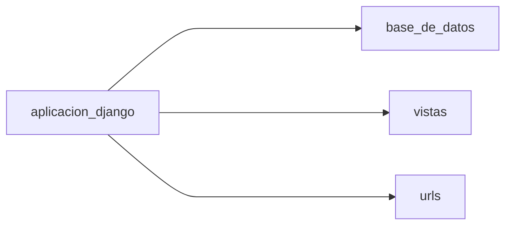
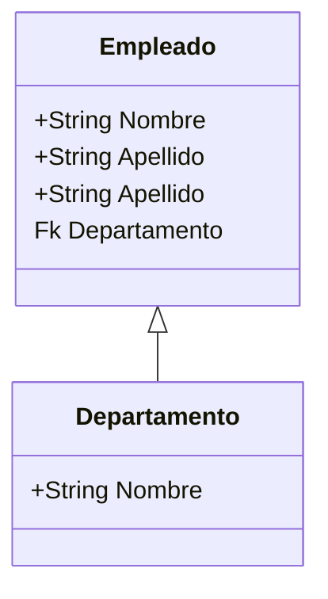
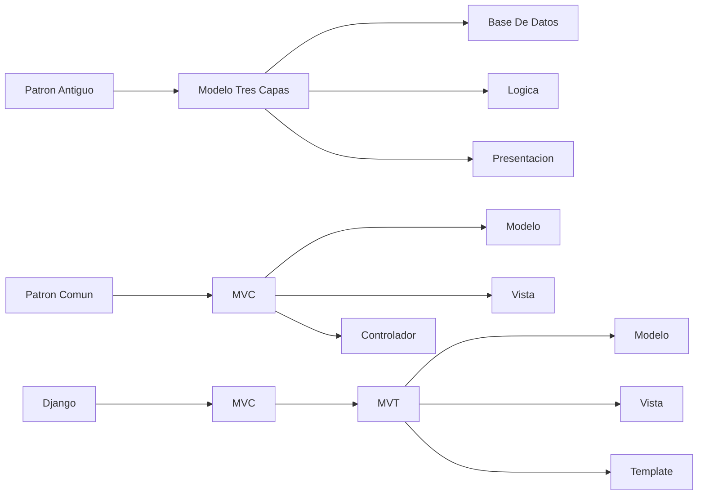
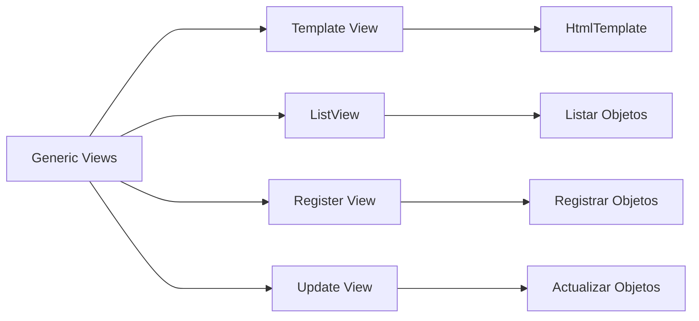
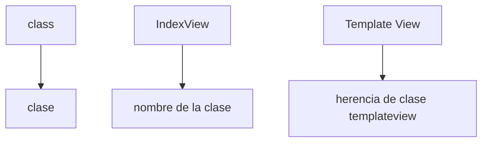
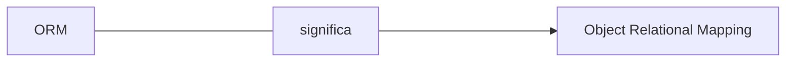

# Curso Django y  Django Rest framework.

- Django Rest framework es un framework de paython para el desarrollo web
- un framework es un marco de trabajo, en este caso un marco de trabajo para Python esto quiere decir que es una 
 manera para llevar a cabo desarrollos con el lenguaje Python.
Los frameworks automatizan una seria de procesos ahorrándonos una gran cantidad de líneas de código
Los frameworks nos brindan un patron de diseño, el cual seguiremos dependiendo del lenguaje que 
estemos utilizando

# Instalacion de Django `(Django 4)`

## `Entornos Virtuales (env - venv)` 
Los entornos virtuales son espacios de trabajo apartados de la memoria y almacenamiento
central de nuestro computador donde podemos realizar configuraciones e instalaciones sin afectar nuestro computador

Los entornos virtuales se utilizan principalmente para evitar conflictos entre versiones de un 
determinado paquete 

## `Creacion de un Ambiente Virtual `
````mermaid
flowchart LR
python --> -m
-m --> venv
venv --> nombre_entorno
lenguaje --> indicamos_tipo_paquete_python
indicamos_tipo_paquete_python --> entorno_virtual
entorno_virtual --> elegir_nombre

````

```
Con el script anterior ya tendriamos una carpeta creada en nuestro directorio nuestro entorno virtual
```
Para poder hacer uso de este entorno virtual que hemos creado debemos activarlo, en la terminal nos movemos hasta el directorio llamado 
`Scripts` y cuando nos encontremos dentro de este directorio ejecutamos el siguiente comando 
``./activate``

Esto nos devolverá en consola lo siguiente 

```
(nombre_entorno) C:\Users\Usuario\Documents\Proyectos\django_restframework_course\Scripts>
```

# Creacion de un proyecto Django en terminal
Antes de crear nuestro proyecto debemos fijarnos en el directorio en que nos encontremos,
ya que al crear el proyecto quedara dentro del directorio en que nos encontremos
creamos un proyecto con el siguiente comando 
```
django-admin startproject nombre_proyecto
```

Este comando nos creará una nueva carpeta en nuestro directorio donde vivira el proyecto django y sus
archivos principales
- manage.py
- init.py 
- settings.py
- urls.py
## Composicion de un Proyecto Django 
___
````mermaid
graph LR
A[proyecto django] -----> B[bases de datos]
A[proyecto django] -----> C[vistas]
A[proyecto django] -----> D[urls]
A[proyecto django] -----> E[aplicacion1]
A[proyecto django] -----> F[aplicacion2]
````
___



```
- Cada Aplicacion debe dedicarse a una logica de negocio especifica y esta puede y debe ser      reutilizada
- Cada Aplicacion debe ser lo mas independiente posible de las demas aplicaciones
- Las aplicaciones son mini proyectos de Django
```

# Proyecto Empleados
| empleados                     | listar | departamentos | administrar |
|-------------------------------|--------|---------------|-------------|
| Imagen                        |
 | Sistema Registro de Empleados |

## Listar
Listar será una pestaña donde podremos listar los trabajadores ingresados en la base de datos 

## Departamentos
Departamentos de una empresa agrupando a los trabajadores. En cada uno de los grupos se despliega una lista con los trabajadores 

## Administrar
Esta pestaña sera un CRUD de trabajadores a la base de datos 

# Base de Datos.



En el modelo de base de datos contiene las tablas empleados y departamento podemos inferir que tenemos 2 aplicaciones y sus tareas seran :
- Controlar Trabajadores 
- Controlar Departamentos
___

# Creacion de una Aplicacion Django.

Comando comunmente usando:

```
python manage.py startapp (nombre_app)
```

Comando Alternativo:
```
django-admin startapp (nombre_app)
```
```
!!!!Nota:
Por buenas practicas debemos crear una carpeta exclusiva en nuestro directorio que albergue nuestras aplicaciones de Django , esta carpeta No puede llevar el nombre de APPS , ya que esta es una palabra reservada de Django.
 
```
Todas las aplicaciones que vayamos creando a medida que avanza el proyecto `se deben registart en el archivo settings del proyecto` bajo el apartadoe de `installed apps` 

```
Ejemplo:

INSTALLED_APPS = [
    'django.contrib.admin',
    'django.contrib.auth',
    'django.contrib.contenttypes',
    'django.contrib.sessions',
    'django.contrib.messages',
    'django.contrib.staticfiles',
    'applications.technical_info',
    'applications.bus',
    'applications.converter',
    'applications.electric_signals',
    'applications.other_signals',
    'applications.status_signals',
    'applications.temperature_signals',
    'rest_framework',
    'corsheaders',

]
```

# Patrones de Diseño.


- Cada aplicacion que vayamos creando debemos agregarle un archivo `urls.py`
y a este archivo le agregamos el contenido del archivo urls.py original del proyecto (`url patterns`)

- En el archivo original de urls debemos importar la libreria `include`, con esto podremos decirle a django que incluya al correr el servidor local , las url que hemos creado en las aplicaciones 

Ejemplo :

```python
path('converter/', include('applications.converter.urls')),
```

# Vistas Genericas en Django.
```python 
from django.views.generics import ....
```

Django en sus vistas genericas trae una gran parte del codigo , ya construido por defecto , para que nosotros solo tengamos que ocuparnos de la logica de negocio de nuestra aplicacion y su personalizacion


___
# Herencia de Clases en las Vistas de Django.


Ejemplo: 

```python
class IndexView(TemplateView):
    template_name = 'index.html'
    queryset = Empleado.objects.all()

```

# ORM.
    

- ORM es un patron de diseño que permite mapear objetos de una aplicacion a una base de datos relacional.
- En palabras simples transforma `codigo Python` en `codigo SQL` para que la base de datos pueda entenderlo y ejecutarlo.

# Modelos en Django.

Ejemplo :

```python
class Empleado(models.Model):
    nombre = models.CharField(max_length=50)
    apellido = models.CharField(max_length=50)
    
    class Meta:
        verbose_name = 'Mi Empleado'
        verbose_name_plural = 'Empleados de la empresa'
        ordering = ['id']

    def __str__(self):
        return str(self.id) + ' - ' + self.nombre + ' ' + self.apellido

```
- Cada vez que creamos un modelo o realizamos alguna modificacion a estos debemos ejecutar el comando `python manage.py makemigrations` para que django cree un archivo de migracion y luego ejecutamos el comando `python manage.py migrate` para que django ejecute las migraciones y cree las tablas en la base de datos.
```python
python manage.py makemigrations   ----> para crear el archivo de migracion
python manage.py migrate          ----> para ejecutar las migraciones
```

## Verificacion de la creacion de la tabla en la base de datos.

- Primero debemos estar seguros de que registramos la aplicacion en el archivo settings del proyecto en el apartado de `installed apps`

- Luego debemos registrar estos modelos en el archivo admin de cada aplicacion , importar los modelos a este archivo.

Ejemplo:

```python
from django.contrib import admin
from .models import Isolation, VoltageBatt24

# Register your models here.
admin.site.register(Isolation),
admin.site.register(VoltageBatt24)
```
Se debe realizar este proceso con cada uno de los modelos que hemos creado en la aplicaciones , si tenemos mas de una aplicacion debemos realizar el mismo proceso.
___