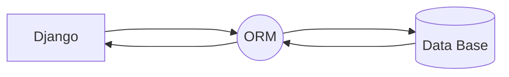
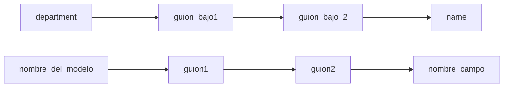

# Curso Django y  Django Rest framework.

- Django Rest framework es un framework de paython para el desarrollo web
- un framework es un marco de trabajo, en este caso un marco de trabajo para Python esto quiere decir que es una 
 manera para llevar a cabo desarrollos con el lenguaje Python.
Los frameworks automatizan una seria de procesos ahorrándonos una gran cantidad de líneas de código
Los frameworks nos brindan un patron de diseño, el cual seguiremos dependiendo del lenguaje que 
estemos utilizando

# Instalacion de Django `(Django 4)`

## `Entornos Virtuales (env - venv)` 
Los entornos virtuales son espacios de trabajo apartados de la memoria y almacenamiento
central de nuestro computador donde podemos realizar configuraciones e instalaciones sin afectar nuestro computador

Los entornos virtuales se utilizan principalmente para evitar conflictos entre versiones de un 
determinado paquete 

## `Creacion de un Ambiente Virtual `
````mermaid
flowchart LR
python --> -m
-m --> venv
venv --> nombre_entorno
lenguaje --> indicamos_tipo_paquete_python
indicamos_tipo_paquete_python --> entorno_virtual
entorno_virtual --> elegir_nombre

````

```
Con el script anterior ya tendriamos una carpeta creada en nuestro directorio nuestro entorno virtual
```
Para poder hacer uso de este entorno virtual que hemos creado debemos activarlo, en la terminal nos movemos hasta el directorio llamado 
`Scripts` y cuando nos encontremos dentro de este directorio ejecutamos el siguiente comando 
``./activate``

Esto nos devolverá en consola lo siguiente 

```
(nombre_entorno) C:\Users\Usuario\Documents\Proyectos\django_restframework_course\Scripts>
```

# Creacion de un proyecto Django en terminal
Antes de crear nuestro proyecto debemos fijarnos en el directorio en que nos encontremos,
ya que al crear el proyecto quedara dentro del directorio en que nos encontremos
creamos un proyecto con el siguiente comando 
```
django-admin startproject nombre_proyecto
```

Este comando nos creará una nueva carpeta en nuestro directorio donde vivira el proyecto django y sus
archivos principales
- manage.py
- init.py 
- settings.py
- urls.py
## Composicion de un Proyecto Django 
___
````mermaid
graph LR
A[proyecto django] -----> B[bases de datos]
A[proyecto django] -----> C[vistas]
A[proyecto django] -----> D[urls]
A[proyecto django] -----> E[aplicacion1]
A[proyecto django] -----> F[aplicacion2]
````
___


```
- Cada Aplicacion debe dedicarse a una logica de negocio especifica y esta puede y debe ser      reutilizada
- Cada Aplicacion debe ser lo mas independiente posible de las demas aplicaciones
- Las aplicaciones son mini proyectos de Django
```

# Proyecto Empleados
| empleados                     | listar | departamentos | administrar |
|-------------------------------|--------|---------------|-------------|
| Imagen                        |
 | Sistema Registro de Empleados |

## Listar
Listar será una pestaña donde podremos listar los trabajadores ingresados en la base de datos 

## Departamentos
Departamentos de una empresa agrupando a los trabajadores. En cada uno de los grupos se despliega una lista con los trabajadores 

## Administrar
Esta pestaña sera un CRUD de trabajadores a la base de datos 

# Base de Datos.


En el modelo de base de datos contiene las tablas empleados y departamento podemos inferir que tenemos 2 aplicaciones y sus tareas seran :
- Controlar Trabajadores 
- Controlar Departamentos
___

# Creacion de una Aplicacion Django.

Comando comunmente usando:

```
python manage.py startapp (nombre_app)
```

Comando Alternativo:
```
django-admin startapp (nombre_app)
```
```
!!!!Nota:
Por buenas practicas debemos crear una carpeta exclusiva en nuestro directorio que albergue nuestras aplicaciones de Django , esta carpeta No puede llevar el nombre de APPS , ya que esta es una palabra reservada de Django.
 
```
Todas las aplicaciones que vayamos creando a medida que avanza el proyecto `se deben registart en el archivo settings del proyecto` bajo el apartadoe de `installed apps` 

```
Ejemplo:

INSTALLED_APPS = [
    'django.contrib.admin',
    'django.contrib.auth',
    'django.contrib.contenttypes',
    'django.contrib.sessions',
    'django.contrib.messages',
    'django.contrib.staticfiles',
    'applications.technical_info',
    'applications.bus',
    'applications.converter',
    'applications.electric_signals',
    'applications.other_signals',
    'applications.status_signals',
    'applications.temperature_signals',
    'rest_framework',
    'corsheaders',

]
```

# Patrones de Diseño.


- Cada aplicacion que vayamos creando debemos agregarle un archivo `urls.py`
y a este archivo le agregamos el contenido del archivo urls.py original del proyecto (`url patterns`)

- En el archivo original de urls debemos importar la libreria `include`, con esto podremos decirle a django que incluya al correr el servidor local , las url que hemos creado en las aplicaciones 

Ejemplo :

```python
path('converter/', include('applications.converter.urls')),
```

# Vistas Genericas en Django.
```python 
from django.views.generics import ....
```

Django en sus vistas genericas trae una gran parte del codigo , ya construido por defecto , para que nosotros solo tengamos que ocuparnos de la logica de negocio de nuestra aplicacion y su personalizacion


___
# Herencia de Clases en las Vistas de Django.


Ejemplo: 

```python
class IndexView(TemplateView):
    template_name = 'index.html'
    queryset = Empleado.objects.all()

```

# ORM.
    

- ORM es un patron de diseño que permite mapear objetos de una aplicacion a una base de datos relacional.
- En palabras simples transforma `codigo Python` en `codigo SQL` para que la base de datos pueda entenderlo y ejecutarlo.

# Modelos en Django.

Ejemplo :

```python
class Empleado(models.Model):
    nombre = models.CharField(max_length=50)
    apellido = models.CharField(max_length=50)
    
    class Meta:
        verbose_name = 'Mi Empleado'
        verbose_name_plural = 'Empleados de la empresa'
        ordering = ['id']

    def __str__(self):
        return str(self.id) + ' - ' + self.nombre + ' ' + self.apellido

```
- Cada vez que creamos un modelo o realizamos alguna modificacion a estos debemos ejecutar el comando `python manage.py makemigrations` para que django cree un archivo de migracion y luego ejecutamos el comando `python manage.py migrate` para que django ejecute las migraciones y cree las tablas en la base de datos.
```python
python manage.py makemigrations   ----> para crear el archivo de migracion
python manage.py migrate          ----> para ejecutar las migraciones
```

## Verificacion de la creacion de la tabla en la base de datos.

- Primero debemos estar seguros de que registramos la aplicacion en el archivo settings del proyecto en el apartado de `installed apps`

- Luego debemos registrar estos modelos en el archivo admin de cada aplicacion , importar los modelos a este archivo.

Ejemplo:

```python
from django.contrib import admin
from .models import Isolation, VoltageBatt24

# Register your models here.
admin.site.register(Isolation),
admin.site.register(VoltageBatt24)
```
Se debe realizar este proceso con cada uno de los modelos que hemos creado en la aplicaciones , si tenemos mas de una aplicacion debemos realizar el mismo proceso.
___

# Super User Django

```python 
python manage.py createsuperuser
```
el script nos pedira que ingresemos un nombre de usuario , un correo electronico y una contraseña , luego de esto ya podremos acceder al panel de administracion de Django.

Luego que hemos creado un super usuario podemos acceder al panel de administracion de Django, esto nos mostrara los modelos que hemos creado hasta el momento y nos permitira agregar , editar y eliminar registros de cada uno de estos modelos.

# Modelos en Django 

```python
class Empleado(models.Model):
    nombre = models.CharField('Nombre', max_length=50)
    apellido = models.CharField('Apellido'max_length=50)
    
    class Meta:
        verbose_name = 'Mi Empleado'
        verbose_name_plural = 'Empleados de la empresa'
        ordering = ['id']

    def __str__(self):
        return str(self.id) + ' - ' + self.nombre + ' ' + self.apellido

```

`def __str__(self):` es un metodo que nos permite retornar un valor en especifico cuando se imprima el objeto en consola.

# Tipos de Campos en Django

AL igual que en SQL , Django en sus modelos tiene tipos de campos que nos permiten definir el tipo de dato que va a almacenar cada uno de los campos de la tabla.

## Tipos de Campos Comunes en Django

### `Charfield`

Se Utiliza para almacenar cadenas de texto , posee los siguientes parametros:
- max_length : Especifica el numero maximo de caracteres que puede almacenar el campo.
- blank : Especifica si el campo puede estar vacio o no.
- choices : Especifica una lista de tuplas que nos permiten definir una lista de opciones que puede tomar el campo.

Ejemplo:

```python
gender = models.CharField(max_length=1, choices=GENDER_CHOICES)
```

### `BooleanField`
Se utiliza para especificar si un campo es verdadero o falso , posee los siguientes parametros:
- default : Especifica el valor por defecto que va a tomar el campo.

## `DateField`
Se utiliza para almacenar fechas , posee los siguientes parametros:
- auto_now : Especifica si el campo va a tomar la fecha actual cada vez que se guarde un registro.
- null especifica si el campo puede ser nulo o no.

## `DateTimeField`
Se utiliza para almacenar fechas y horas

# Relaciones Entre Modelos.

```python 
class Empleado(models.Model):
    job_choices = (
        ('0', 'Contador'),
        ('1', 'Administrador'),
        ('2', 'Economista'),
        ('3', 'Otro'),
    )
    first_name = models.CharField('Nombre', max_length=50)
    last_name = models.CharField('Apellido', max_length=50)
    job = models.CharField('Puesto', max_length=1, choices=job_choices)
    department = models.ForeignKey(Department, on_delete=models.CASCADE)
```
Departamento actua como ForeingKey en el modelo Empleado , esto nos permite relacionar un empleado con un departamento.


```

Django utiliza ORM para comunicar se con la base de datos (codigo python a SQL).
Debemos indicarle a la ORM el gestor de base de datos que estamos usando en el proyecto , para esto debemos ir al archivo settings.py del proyecto y modificar el apartado de `DATABASES` , en este apartado debemos especificar el gestor de base de datos que estamos usando , el nombre de la base de datos , el usuario y la contraseña de la base de datos.

Cada vez que realizamos una modificacion o nos conectamos a una nueva base de datos debemos ejecutar el comando `python manage.py makemigrations` para que django cree un archivo de migracion y luego ejecutamos el comando `python manage.py migrate` para que django ejecute las migraciones y cree las tablas en la base de datos.

Tabien debemos volver a crear un super usuario para poder acceder al panel de administracion de Django.

```python 
python manage.py createsuperuser
```

# Class Meta en Models
Class Meta nos permite definir metadatos para nuestros modelos , estos metadatos nos permiten definir el nombre de la tabla en la base de datos , el nombre de cada uno de los campos de la tabla , el orden en el que se van a mostrar los registros de la tabla , etc.

```python
class Meta:
    verbose_name = 'Mi Empleado'
    verbose_name_plural = 'Empleados de la empresa'
    ordering = ['id']
    unique_together = ('first_name', 'last_name')
```
`unique together` nos permite definir que dos campos no pueden tener el mismo valor , en este caso no puede haber dos empleados con el mismo nombre y apellido.

# Administrador de Django.

## Personalizando Modelos en el Panel de Django.
Podemos personalizar como se vera nuestro modelo en el panel de administracion por medio de la creacion de una clase en el archivo `admin.py` de cada aplicacion.

```python
class EmpleadoAdmin(admin.ModelAdmin):
    list_display = ('id', 'first_name', 'last_name', 'job', 'full_name')
    search_fields = ('first_name', 'last_name')
    list_filter = ('job', 'department', 'hire_date')
```

Luego tal como registramos el modelo en una primera instancia , ahora registramos el modelo y esta clase que hemos creado.


```python
admin.site.register(Empleado, EmpleadoAdmin)
```
Esta Modificacion nos mostrara el modelo creado en backend , en una tabla tal como si nos encontraramos en una base de datos.

- search_fields nos permite buscar registros por medio de los campos que le especifiquemos , en este caso podemos buscar registros por medio del nombre y apellido del empleado.

- list_filter nos permite filtrar los registros por medio de los campos que le especifiquemos , en este caso podemos filtrar los registros por medio del puesto , departamento y fecha de contratacion.

- Estos campos son tuplas, en el caso de solo querer un solo campo podemos escribir lo siguiente 

```python
search_fields = ('first_name',)
```

## Agregar Campos al Panel de Administracion de Django.

```python
class EmpleadoAdmin(admin.ModelAdmin):
    list_display = ('id', 'first_name', 'last_name', 'job', 'full_name')
    search_fields = ('first_name', 'last_name')
    list_filter = ('job', 'department', 'hire_date')
    list_editable = ('job',)

    def full_name(self, obj):
        return obj.first_name + ' ' + obj.last_name
```

La funcion full name que concatena dos propiedades del modelo , nos permite agregar un campo al panel de administracion de Django , en este caso el campo full_name.


# Vistas Genericas en Django.

## ListView.
ListView nos permite listar los registros de un modelo en una vista , para esto debemos importar la clase ListView de django.views.generic.list y luego debemos crear una clase que herede de esta clase.

```python
from django.views.generic.list import ListView

class EmpleadoListView(ListView):
    model = Empleado
    template_name = 'persona/list_all.html'
    context_object_name = 'empleados'
```

context_object_name nos permite especificar el nombre de la variable que vamos a utilizar en el template para iterar sobre los registros de la base de datos.

Usando esta vista solucionaremos los siguientes requerimientos:
- listar todos los empleados de la empresa.
- listar todos los empleados que pertenecen a un departamento en especifico.
- listar todos los empleados que pertenecen a un area en especifico.
- listar a los empleados por una palabra clave 
- listar habilidades de un empleado 

Con la clase ListView debemos usar el metodo `queryset` para filtrar los registros de la base de datos , este metodo nos permite filtrar los registros de la base de datos por medio de una consulta SQL.

Resumiento este metodo nos permite indicar que datos dentro del modelo queremos mostrar en la vista.

```python
queryset = Empleado.objects.filter(
    job='0',
    department__name='IT'
)
```

lo que estamos haciendo en esta queryset es filtrar todos los empleados que cumplan con ambas condiciones que su job sea igual a 0 y que pertenezca al departamento IT 
Podemos  usar como filtro `department__ name = 'IT'` porque department es una ForeingKey y podemos acceder a sus propiedades.


```
!!! Esta es la manera clasica de realizar filtros , pero no es la mas eficiente
```
### `funcion get_queryset`
Este metodo siempre debe retornar una lista de elementos 
```python
def get_queryset(self):
    lista = empleado.objects.filter(
        department__name='IT'
    )
```

## `Filtros Con Parametros URL`

- preparamos la url 
```python
path('lista_empleados_area/<name>', views.ListaEmpleadosByArea.as_view(), name='empleados_area'),
```

< name > =  este parametro indica que partes de la url se va a pasar como parametro a la vista. por medio de una variable 

- preparamos la vista 
```python
class ListaEmpleadosByArea(ListView):
    template_name = 'persona/list_by_area.html'
    context_object_name = 'empleados'

    def get_queryset(self):
        area = self.kwargs['name']
        lista = Empleado.objects.filter(
            department__name=area
        )
        return lista
```