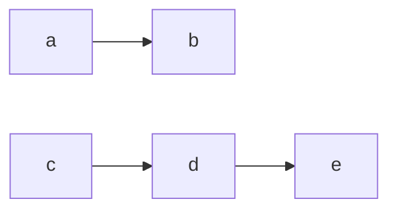
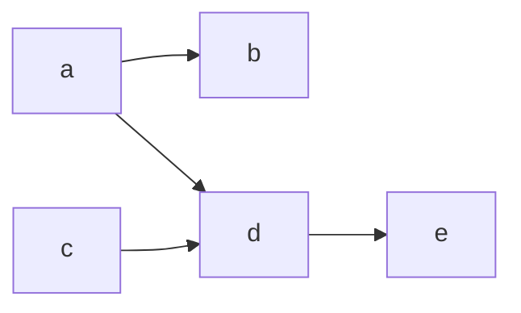
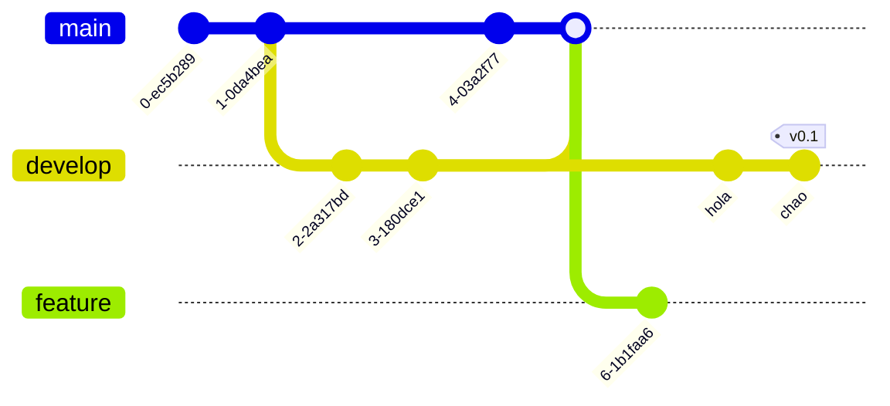

## Mermaid Flowcharts

### Flowchart LR
***


```
` ` ` mermaid
flowchart LR
a -->b
c -->d
d -->e

` ` `
```



```
` ` ` mermaid
flowchart LR
a -->b
c -->d
d -->e
a -->d
` ` `
```



### Flowchart TD
***

```
` ` `mermaid
graph TD
 A-->B;
    A-->C;
    B-->D;
    C-->D;
` ` `

```


### Git Graph.

```
` ` `mermaid
gitGraph
commit
commit
branch develop
commit
commit
checkout main
commit
commit
` ` `
```


